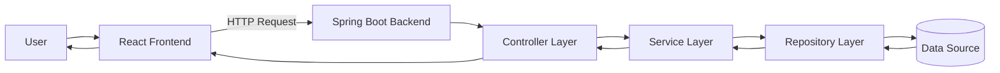
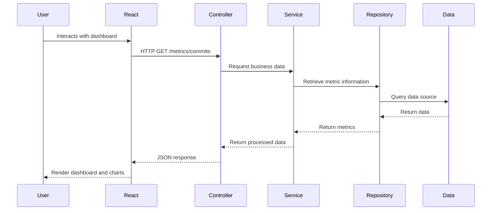

# Full Stack Project Technical Analysis

## Course Activity: Full Stack Project Analysis and Technical Evaluation

### Objective

The purpose of this project is to analyze and evaluate the architecture, code organization, design patterns, and development practices implemented in a Full Stack application composed of:

* A **Spring Boot Backend**
* A **React Frontend**

The analysis focuses on identifying the main architectural components, understanding their responsibilities, documenting the request and data flow, and proposing technical improvements.

---

## Analyzed Repositories

### Backend Repository

Repository analyzed:

`Desktop/gitfinal`

Technology Stack:

* Java
* Spring Boot
* Maven
* REST API

Documentation:

➡️ See: **README_BACKEND.md**

---

### Frontend Repository

Repository analyzed:

https://github.com/franciscogomez2722/gitFinalFrontProgramacionWeb

Technology Stack:

* React
* Vite
* Axios
* Chart.js
* React ChartJS 2

Documentation:

➡️ See: **README_FRONTEND.md**

---

# Project Architecture Overview

---

# Deliverables

## Part 1 – Backend Analysis

The backend analysis includes:

* Project structure
* Controller layer
* Service layer
* Repository layer
* DTO analysis
* Entity/Model analysis
* Request flow
* Security and CORS configuration
* Technical improvement proposals
* Architecture diagrams

Documentation:

📄 **README_BACKEND.md**

---

## Part 2 – Frontend Analysis

The frontend analysis includes:

* Folder structure
* Main React components
* State management with Hooks
* API consumption
* Data flow between components
* Charts and visualizations
* Technical improvement proposals
* Architecture diagrams

Documentation:

📄 **README_FRONTEND.md**

---

# Full Stack Request Flow

---

# Main Findings

## Backend

### Strengths

* Clear layered architecture
* Separation of concerns
* RESTful API design
* Simple and maintainable structure

### Opportunities for Improvement

* Add persistent database integration
* Improve DTO usage consistency
* Expand security configuration
* Improve validation and exception handling

---

## Frontend

### Strengths

* Simple React architecture
* Dedicated service layer for API communication
* Effective use of Hooks
* Chart.js integration for data visualization

### Opportunities for Improvement

* Add loading and error states
* Use environment variables for API URLs
* Improve component modularization
* Add automated testing
* Remove unused scaffold files

---

# Conclusion

The analyzed Full Stack solution demonstrates a clear separation between frontend and backend responsibilities. The React frontend consumes metrics exposed by the Spring Boot backend and presents them through dashboard cards and visualizations.

While the implementation successfully demonstrates the fundamental concepts of Full Stack development, several improvements could increase maintainability, scalability, and production readiness, particularly in configuration management, error handling, testing, and architectural consistency.

This repository contains the complete technical analysis of both application layers as required by the assignment.
