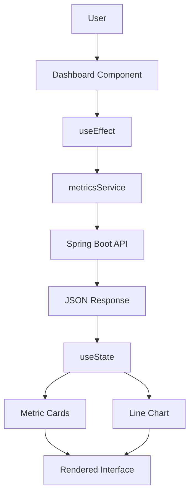
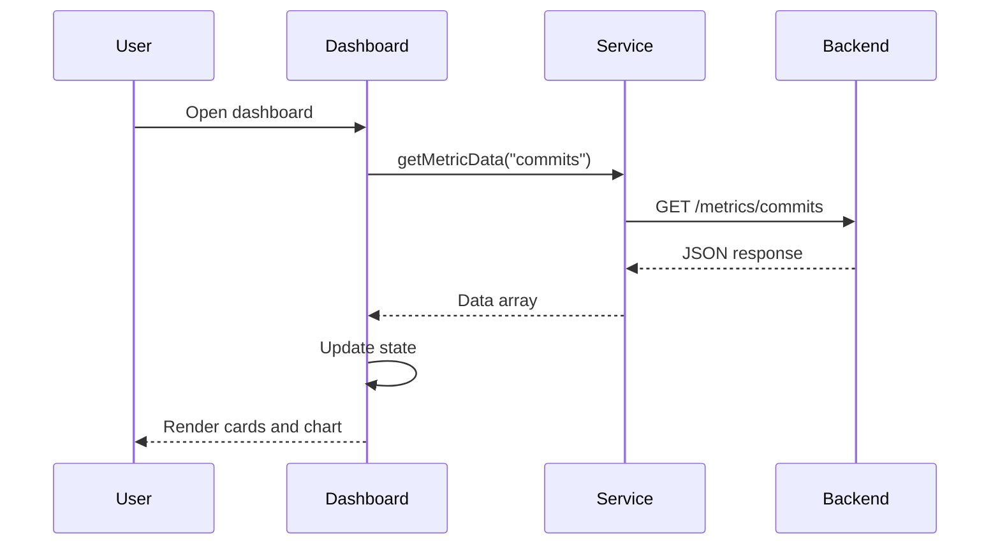

# Frontend Technical Analysis

**Repository Analyzed:** https://github.com/franciscogomez2722/gitFinalFrontProgramacionWeb

---

# 1. Repository Overview

This project is a React-based productivity dashboard that consumes data from a Spring Boot backend and displays development metrics through summary cards and graphical visualizations.

The application follows a simple component-based architecture and focuses on presenting metric data retrieved from a REST API.

## Technologies Used

* React
* Vite
* Axios
* Chart.js
* React ChartJS 2
* ESLint

## General Architecture

The application follows a straightforward architecture:

```text
main.jsx
   ↓
App.jsx
   ↓
Dashboard.jsx
   ↓
API Service
   ↓
Spring Boot Backend
```

The frontend is responsible for requesting metric information from the backend, storing the data in React state, and rendering charts and summary cards.

---

# 2. Folder Structure

```text
gitFinalFrontProgramacionWeb/
│
├── productivity-dashboard/
│   ├── public/
│   ├── src/
│   │   ├── assets/
│   │   ├── component/
│   │   │   └── Dashboard.jsx
│   │   ├── services/
│   │   │   └── metricsService.js
│   │   ├── App.jsx
│   │   ├── main.jsx
│   │   ├── App.css
│   │   └── index.css
│   │
│   ├── package.json
│   ├── vite.config.js
│   └── eslint.config.js
```

## Main Files and Directories

### `src/`

Contains the application source code.

### `component/`

Contains the main dashboard component responsible for rendering metrics and charts.

### `services/`

Contains the service layer responsible for API communication.

### `assets/`

Stores static resources such as images and icons.

### `App.jsx`

Root component that renders the dashboard.

### `main.jsx`

Application entry point that mounts React into the DOM.

### `package.json`

Defines project dependencies and scripts.

### `vite.config.js`

Configuration file for the Vite development environment.

### `eslint.config.js`

Defines linting rules and code quality settings.

### Not Identified

The following common frontend folders were not identified in the repository:

* pages/
* hooks/
* context/
* utils/
* router/

---

# 3. Main Components

## App.jsx

The root component of the application.

Responsibilities:

* Loads the main dashboard.
* Serves as the application's entry component.

Example:

```jsx
function App() {
  return <Dashboard />;
}
```

---

## Dashboard.jsx

This is the main functional component of the project.

Responsibilities:

* Fetch data from the backend API.
* Store data in React state.
* Calculate summary metrics.
* Generate chart datasets.
* Render KPI cards and charts.

Main features:

* Total commits calculation.
* Average commits calculation.
* Maximum commits calculation.
* Line chart visualization.

---

## MetricCard Component

A small reusable presentation component defined inside `Dashboard.jsx`.

Responsibilities:

* Display a metric title.
* Display a metric value.
* Provide a simple dashboard card layout.

---

# 4. State Management with Hooks

The application uses React Hooks for local state management.

## useState

Used to store metric data retrieved from the backend.

Example:

```javascript
const [data, setData] = useState([]);
```

Purpose:

* Store API responses.
* Trigger component re-rendering when data changes.

---

## useEffect

Used to load data when the component is first rendered.

Example:

```javascript
useEffect(() => {
    loadData();
}, []);
```

Purpose:

* Execute API requests after component mounting.
* Prevent repeated requests during re-renders.

---

## Custom Hooks

No custom hooks were identified in the repository.

---

# 5. API Consumption

The frontend communicates with the backend using **Axios**.

## Service Layer

API communication is centralized in:

```text
src/services/metricsService.js
```

Example:

```javascript
import axios from "axios";

const API_URL = "http://localhost:8080/metrics";

export const getMetricData = async (metric) => {
    const response = await axios.get(`${API_URL}/${metric}`);
    return response.data;
};
```

## Endpoint Identified

| Method | Endpoint           |
| ------ | ------------------ |
| GET    | `/metrics/commits` |

The service is designed to support different metric types through the `metric` parameter.

---

# 6. Data Flow Between Components

The application follows a simple data flow model.

```text
User
 ↓
Dashboard Component
 ↓
useEffect
 ↓
API Service
 ↓
Spring Boot Backend
 ↓
JSON Response
 ↓
React State Update
 ↓
UI Re-render
```

## Detailed Flow

1. The user opens the dashboard.
2. `Dashboard.jsx` renders.
3. `useEffect()` executes.
4. `getMetricData("commits")` is called.
5. Axios sends an HTTP request.
6. The backend returns JSON data.
7. `setData()` updates component state.
8. Summary metrics are recalculated.
9. The chart is updated.
10. The user sees the new information.

---

# 7. Charts and Visualizations

The application includes dashboard-style visualizations.

## Metric Cards

Three summary cards display:

* Total Commits
* Daily Average
* Maximum Value

---

## Line Chart

The project uses:

* Chart.js
* React ChartJS 2

The line chart visualizes the evolution of commit metrics over time.

### Features

* Responsive layout
* Dynamic labels
* Dynamic values from API data
* Visual trend representation

No additional charts or dashboard visualizations were identified.

---

# 8. Frontend Flow Diagram



---

# 9. API Request Flow Diagram



---

# 10. Technical Improvements

Several improvements could enhance maintainability and scalability.

## 1. Environment Variables

Replace hardcoded API URLs with environment variables.

Example:

```javascript
const API_URL = import.meta.env.VITE_API_URL;
```

---

## 2. Loading States

Display loading indicators while data is being retrieved.

Example:

```javascript
const [loading, setLoading] = useState(false);
```

---

## 3. Error Handling

Display user-friendly error messages when API requests fail.

Example:

```javascript
const [error, setError] = useState(null);
```

---

## 4. Component Separation

Move `MetricCard` into its own file to improve reusability and maintainability.

---

## 5. Folder Organization

As the project grows, adding dedicated folders would improve scalability:

```text
src/
├── components/
├── pages/
├── hooks/
├── services/
├── utils/
└── assets/
```

---

## 6. Automated Testing

Add unit and integration tests using:

* Jest
* React Testing Library

---

## 7. TypeScript Migration

Using TypeScript would improve type safety and developer experience.

---

# 11. Conclusion

The frontend project implements a simple but effective React dashboard that consumes data from a Spring Boot backend and presents it through metric cards and charts.

The architecture is easy to understand and demonstrates important frontend development concepts such as component-based design, API consumption, React Hooks, and data visualization.

### Strengths

* Clear component structure.
* Dedicated service layer for API requests.
* Effective use of React Hooks.
* Integration with Chart.js for visual analytics.
* Simple and maintainable architecture.

### Areas for Improvement

* Better error handling.
* Loading indicators.
* Environment-based configuration.
* More modular component organization.
* Automated testing.
* Stronger typing with TypeScript.

Overall, the project successfully demonstrates the core concepts of frontend development in a Full Stack application and provides a solid foundation for future enhancements.
